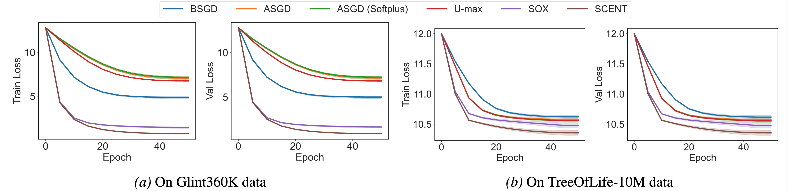
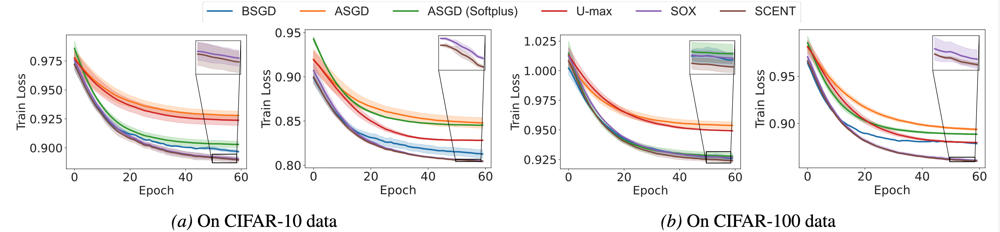

<h1 align="center">A Geometry-Aware Efficient Algorithm for Compositional Entropic Risk Minimization</h1>

Paper link: [arXiv](https://arxiv.org/abs/2602.02877)

**How can we efficiently solve the Log-Sum-Exp problem when the summation is over a large number of terms?**

- We study compositional entropic risk minimization, in which each data’s loss is formulated as a Log-Expectation-Exponential (Log-E-Exp) problem, a generalization of the Log-Sum-Exp problem.
- We leverage the dual formulation of the Log-E-Exp problem to avoid its fundamental limitations, such as non-convergence, numerical instability and slow convergence rates.
- We propose a geometry-aware stochastic algorithm, termed **SCENT**, for the dual formulation. Then we provide a comprehensive convergence analysis of SCENT for convex problems.
- We conduct extensive experiments on various tasks, including Extreme Classification, Partial AUC Maximization, Contrastive Learning and Distributionally Robust Optimization to validate the effectiveness of SCENT.

## Experimental Results

The following figure presents a comparison between methods on the Extreme Classification task. It can be observed that SCENT achieves lower training and validation losses compared to other methods.

<p align="center"></p>

The following figure presents a comparison between methods on the Partial AUC Maximization task. And a similar trend can be observed.

<p align="center"></p>

## Getting Started

The instructions for running the code can be found in the folder of individual tasks:
- Extreme Classification: [xc/README.md](./xc/README.md)
- Partial AUC Maximization: [pauc/README.md](./pauc/README.md)
- Contrastive Learning: [contrastive/README.md](./contrastive/README.md)
- Distributionally Robust Optimization: [dro/README.md](./dro/README.md)

## Citation

If you find this work useful in your research, please consider citing:
```bibtex
@article{wei2026geometry,
  title={A Geometry-Aware Efficient Algorithm for Compositional Entropic Risk Minimization},
  author={Wei, Xiyuan and Zhou, Linli and Wang, Bokun and Lin, Chih-Jen and Yang, Tianbao},
  journal={arXiv preprint arXiv:2602.02877},
  year={2026}
}
```
